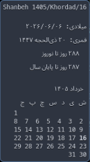

# waybar-jalali-calendar

[](https://github.com/sunba91-su/waybar-jalali-calendar/actions/workflows/test.yml)
[](https://pypi.org/project/waybar-jalali-calendar/)
[](https://pypi.org/project/waybar-jalali-calendar/)
[](https://github.com/sunba91-su/waybar-jalali-calendar/blob/main/LICENSE)
[](https://github.com/sunba91-su/waybar-jalali-calendar)

**Jalali (Persian/Solar Hijri) calendar module for [Waybar](https://github.com/Alexays/Waybar).**  
Works on **Sway**, **Hyprland**, and any Wayland compositor using Waybar.



---

## ✨ Features

- **Jalali date** in the bar with full Persian text (e.g., `۱۶ خرداد ۱۴۰۵`)
- **Calendar grid** in tooltip showing the full month with today highlighted
- **Holiday detection** — both fixed Jalali holidays (Nowruz, 22 Bahman, etc.) and movable Hijri holidays (Ashura, Ramadan, Eid)
- **Nowruz countdown** — shows days remaining until the Persian New Year
- **Year-end countdown** — remaining days in the current year
- **Gregorian & Hijri dates** in tooltip
- **Click navigation** — scroll through months in the tooltip via scroll wheel; click to reset
- **Weekend styling** — Friday (جمعه) gets a special CSS class
- **Persian numerals** — numbers displayed in Arabic-Indic digits (۰-۹)

---

## ⚡ Quick Start

```bash
pip install waybar-jalali-calendar
```

Then add to your Waybar config (see [Configuration](#-waybar-configuration) below).

---

## 📦 Installation Options

### Using pip (recommended)

```bash
pip install waybar-jalali-calendar
```

### From source

```bash
git clone https://github.com/sunba91-su/waybar-jalali-calendar.git
cd waybar-jalali-calendar
pip install .
```

### Using pipx (isolated)

```bash
git clone https://github.com/sunba91-su/waybar-jalali-calendar.git
cd waybar-jalali-calendar
pipx install .
```

### Using Makefile

```bash
make install       # user install
# or
make install-system  # system-wide
```

### Arch Linux (AUR)

```bash
# Coming soon — or build from dist/arch/PKGBUILD
```

---

## 🎨 Waybar Configuration

<details>
<summary><b>config (~/.config/waybar/config)</b></summary>

```json
"custom/shamsi-date": {
    "exec": "waybar-jalali-calendar",
    "format": "{}",
    "interval": 3600,
    "return-type": "json",
    "signal": 1,
    "on-click": "waybar-jalali-calendar --reset && pkill -SIGRTMIN+1 waybar",
    "on-scroll-up": "waybar-jalali-calendar --next && pkill -SIGRTMIN+1 waybar",
    "on-scroll-down": "waybar-jalali-calendar --prev && pkill -SIGRTMIN+1 waybar"
}
```
</details>

<details>
<summary><b>style (~/.config/waybar/style.css)</b></summary>

```css
#custom-shamsi-date {
    font-weight: bold;
    padding: 0 8px;
    margin: 2px 0;
    border-radius: 4px;
}

#custom-shamsi-date.holiday {
    color: #bf616a; /* red for holidays */
}

#custom-shamsi-date.weekend {
    color: #ebcb8b; /* yellow for Friday (Jomeh) */
}
```
</details>

Restart Waybar:

```bash
pkill waybar && waybar &
# or, if signals are configured:
pkill -SIGRTMIN+1 waybar
```

---

## 🕹 Usage

Once installed and configured, the calendar appears in your Waybar:

- **Bar text**: ` ۱۶ خرداد ۱۴۰۵` (current date with Persian digits) — shows a `🎉` icon on holidays
- **Tooltip** (hover): Full date info, Hijri date, Nowruz countdown, and a monthly calendar grid with today highlighted
- **Scroll up/down**: Navigate through months in the tooltip
- **Click**: Reset back to the current month

### CLI Commands

```bash
waybar-jalali-calendar          # Output Waybar JSON (called by Waybar)
waybar-jalali-calendar --reset  # Reset to current month
waybar-jalali-calendar --next   # Show next month
waybar-jalali-calendar --prev   # Show previous month
```

---

## 📅 Holiday Coverage

### Fixed Jalali Holidays
- Nowruz (1–4 Farvardin)
- Islamic Republic Day (12 Farvardin)
- Sizdah Bedar (13 Farvardin)
- Death of Khomeini (14 Khordad)
- 15 Khordad Uprising (15 Khordad)
- Islamic Revolution Victory (22 Bahman)
- Nationalization of Oil (29 Esfand)

### Hijri (Lunar) Holidays
- Tasua (9 Muharram)
- Ashura (10 Muharram)
- Arba'een (20 Safar)
- Death of Prophet (28 Safar)
- Martyrdom of Imam Reza (30 Safar)
- Mab'ath (27 Rajab)
- Birth of Imam Mahdi (15 Sha'ban)
- Ramadan (1 Ramadan)
- Eid al-Fitr (1–2 Shawwal)
- Eid al-Adha (10 Dhu al-Hijjah)
- Eid al-Ghadir (18 Dhu al-Hijjah)

---

## 🛠 Development

```bash
git clone https://github.com/sunba91-su/waybar-jalali-calendar.git
cd waybar-jalali-calendar
pip install -e ".[test]"
python -m pytest tests/ -v --cov
```

---

## 📝 Uninstall

```bash
pip uninstall waybar-jalali-calendar
rm -f ${XDG_RUNTIME_DIR:-/tmp}/waybar-jalaly-state  # clean up state file
```

---

## 📄 License

GNU General Public License v3.0 or later. See [LICENSE](LICENSE).
